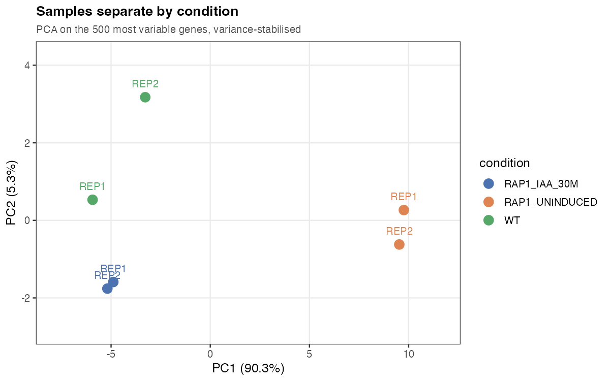
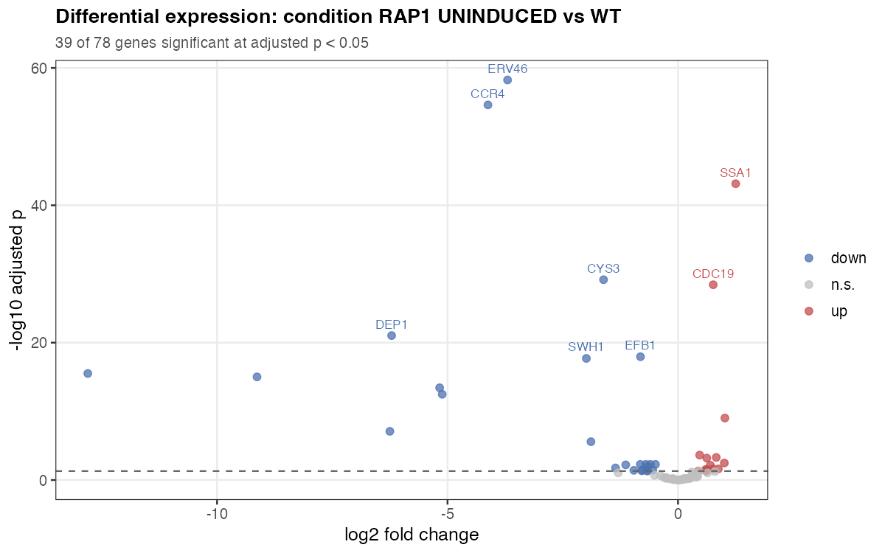
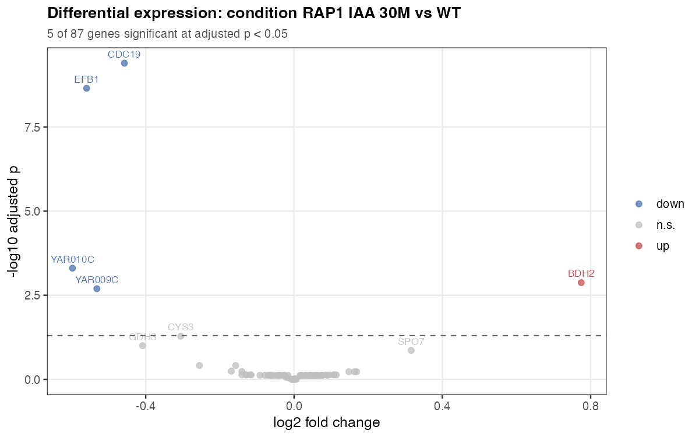
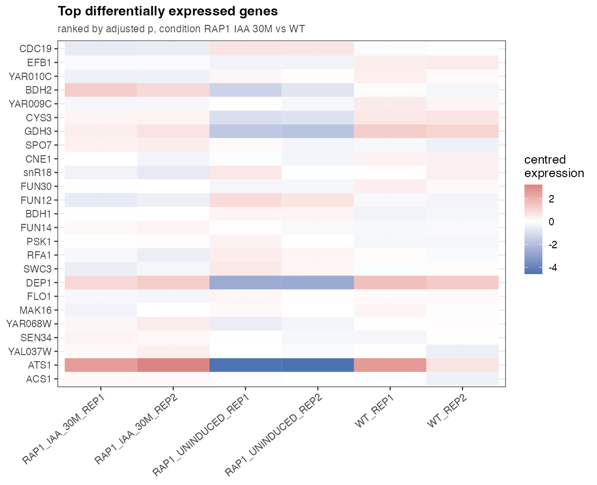
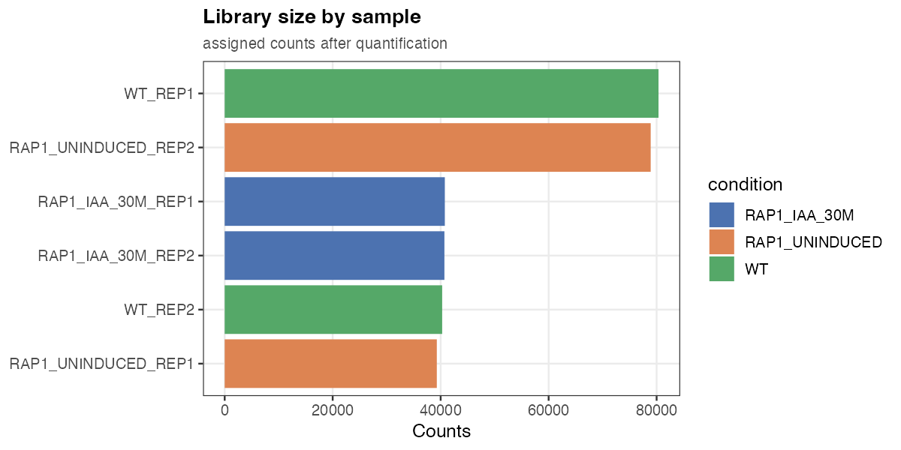

# Worked example: yeast RAP1 induction

A complete run of this pipeline on a real public dataset, start to finish, in about two
minutes on a laptop. Everything below was produced by the pipeline itself — the figures
are committed here so you can see the output without running anything.

Reproduce it with:

```bash
./test/run_test.sh
Rscript example/make_figures.R test/data/results
```

## The data

Subsampled RNA-seq from [nf-core/test-datasets](https://github.com/nf-core/test-datasets/tree/rnaseq),
originally [GSE110004](https://www.ncbi.nlm.nih.gov/geo/query/acc.cgi?acc=GSE110004) — a
*Saccharomyces cerevisiae* experiment in which the transcription factor RAP1 is depleted
using an auxin-inducible degron.

| Condition | Samples | Meaning |
|---|---|---|
| `WT` | 2 | wild type |
| `RAP1_UNINDUCED` | 2 | degron strain, no auxin — RAP1 still present |
| `RAP1_IAA_30M` | 2 | degron strain, 30 min auxin — RAP1 depleted |

The sample sheet is deliberately awkward, because that is what makes it a real test of the
input handling:

- `WT_REP1` and `RAP1_UNINDUCED_REP2` each span **two sequencing lanes**, which the
  pipeline merges automatically
- the `RAP1_UNINDUCED` samples are **single-end** while the others are **paired-end**, in
  the same run
- three conditions, two replicates each — a genuine DESeq2 design

The reference is a ~200 kb subset of the yeast genome, which is why only 124 genes are
quantified. That keeps the test fast; the pipeline itself is not restricted in any way.

## What ran

```
fastp → Salmon (selective alignment) → tximport → DESeq2 → report
```

Salmon auto-detected the library type per sample, correctly identifying `ISR` for the
paired-end libraries and `SR` for the single-end ones. Mapping rates were 80–85% across
all six samples, and the two multi-lane samples show roughly double the reads of the
others — confirming the lane-merging worked.

## Results

**Samples group by condition.** PC1 captures 90.3% of the variance and separates
RAP1-depleted, uninduced and wild type into three clean clusters.



**Differential expression.** Depleting RAP1 for 30 minutes changes far fewer genes at
adjusted p < 0.05 than the uninduced-vs-wild-type comparison does, which is the more
interesting result: the degron strain differs from wild type even before auxin is added.





| Contrast | Genes tested | Significant (adj. p < 0.05) |
|---|---|---|
| `RAP1_UNINDUCED` vs `WT` | 78 | 39 |
| `RAP1_IAA_30M` vs `WT` | 78 | 5 |

The top hits are recognisable yeast genes — `SSA1` (heat-shock chaperone), `CDC19`
(pyruvate kinase), `CCR4` (mRNA deadenylase), `ERV46` (ER–Golgi transport) — rather than
noise, which is the basic sanity check on any RNA-seq result.





## Full output

The run also produces a self-contained HTML report (`results/05_report/rnaseq_report.html`)
covering mapping rates, library sizes, sample correlation, PCA, per-contrast volcano and
MA plots, and ranked gene tables — the artefact you would actually hand to a collaborator.
Every figure in it is backed by a TSV in `results/05_report/summary_tables/`.

Selected tables are committed here under [`results/`](results/).

## Reading these numbers honestly

This is a deliberately tiny dataset: 124 genes on a 200 kb reference subset, two
replicates per group. It demonstrates that the pipeline runs correctly end to end and
produces sensible output — it is not a biological finding. The absolute number of
significant genes would change substantially on the full genome, and with n=2 the
power to detect modest effects is low.
